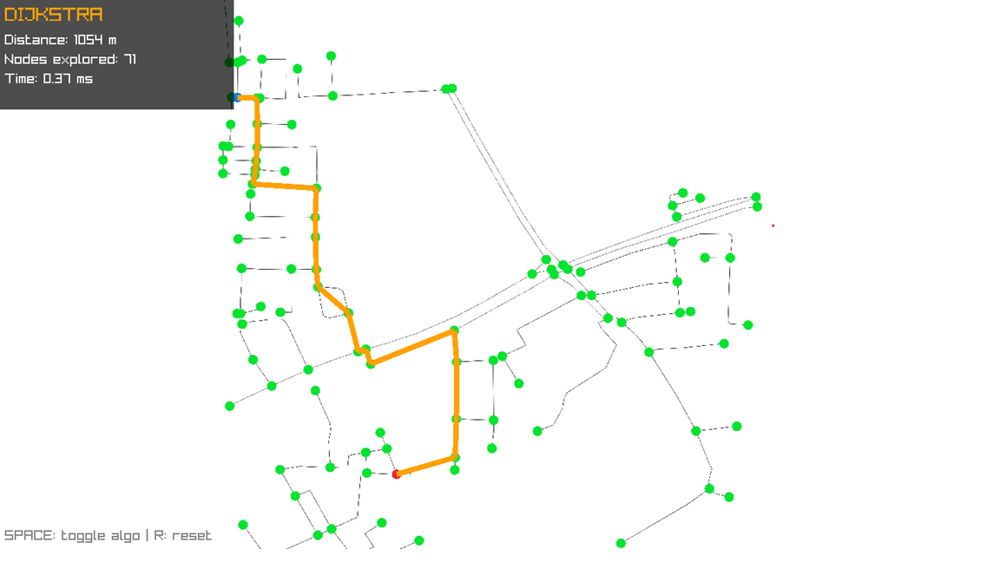

# 🗺️ Pathfinder Visualizer

A real-world pathfinding visualizer built with **C++** and **Raylib**, using live street network data from **OpenStreetMap** of Jaipur, India.

Implements and compares **Dijkstra's Algorithm** and **A\*** side-by-side with interactive visualization.

---

## 📸 Demo



---

## ✨ Features

- 🛰️ **Real Map Data** — Road network fetched from OpenStreetMap using `osmnx`
- 🖱️ **Click to Select** — Click directly on the map to set start and end points
- ⚡ **Dijkstra vs A\*** — Both algorithms run simultaneously on the same path
- 🔁 **Toggle Algorithms** — Press `SPACE` to switch between Dijkstra and A\*
- 📊 **Live Stats Panel** — Shows distance, nodes explored, and time taken
- 🎨 **Color Coded** — Dijkstra in Orange, A\* in Blue
- 🔄 **Reset** — Press `R` to clear and pick new points

---

## 📊 Algorithm Comparison

| | Dijkstra | A\* |
|---|---|---|
| Strategy | Explores all directions equally | Guided by heuristic toward destination |
| Nodes Explored | More | Fewer (~24% less) |
| Path Quality | Optimal | Optimal |
| Speed | Slower | Faster |

A\* uses the **Haversine formula** as its heuristic — the real-world straight-line distance between two GPS coordinates.

---

## 🛠️ Setup

### 1. Install Python dependencies
```bash
pip install osmnx matplotlib pillow
```

### 2. Generate map data
```bash
cd src
python map_loader.py
```

This generates `maps/map.png`, `maps/map_bounds.json`, `maps/map_graph.json`.

### 3. Compile
```bash
g++ src/main.cpp -o app -Idependencies/include -Ldependencies/lib -lraylib -lopengl32 -lgdi32 -lwinmm
```

### 4. Run
```bash
app.exe
```

---

## 🎮 Controls

| Action | Input |
|---|---|
| Set start point | Left click |
| Set end point | Left click |
| Toggle Dijkstra / A\* | SPACE |
| Reset | R |
| Zoom | Mouse wheel |
| Pan | Right mouse drag |

---

## 📦 Project Structure

| File | Description |
|---|---|
| `src/main.cpp` | App entry point, click handling, render loop |
| `src/pathfinder.hpp` | Dijkstra and A\* implementations |
| `src/graph.hpp` | Graph structure loaded from JSON |
| `src/renderer.hpp` | Raylib rendering, pan, zoom |
| `src/map_loader.py` | Fetches OSM data and generates map files |

---

## 🧠 How It Works

1. `map_loader.py` fetches Jaipur's road network from OpenStreetMap using `osmnx`
2. Roads are saved as a graph (`map_graph.json`) with nodes (intersections) and edges (roads with weights)
3. The C++ program loads this graph and renders it using Raylib
4. On click, the nearest node is selected as start/end
5. Both Dijkstra and A\* run on the graph and results are displayed with stats

---

## 🔧 Tech Stack

- **C++17** — Core algorithms and application logic
- **Raylib** — Graphics, input, rendering
- **Python + osmnx** — Map data fetching from OpenStreetMap
- **nlohmann/json** — JSON parsing in C++

---

## 📜 License

MIT — use freely with credit.